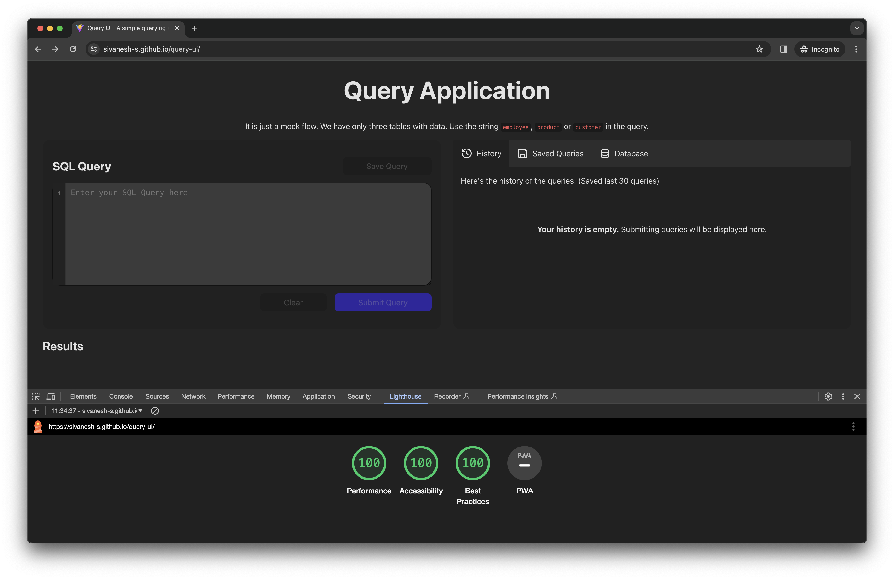

# Query UI ([Live Demo](https://sivanesh-s.github.io/query-ui/))

This is a simple SPA which lets you query a data, and download the results. It also provides some better UX and features for data analysts for an ease of use. 

## Video demo

## Features

1. It is keyboard accessible.
2. Table data is virtualized. So you can see thousands of records without any slowness in the application.
3. Query history is saved. Uses `localStorage` and saves the recent 30 queries. 
4. You can save indivual queries for later use. 
5. There is a `Database` tab in the helper section that allows you to see all the possible tables and it's schema. 
6. If you query valid results, then you can download them as a `.json` file or you can copy the contents as **JSON.**

## Tech stack

I'm using React with Vite for this project. (So that I can also easily deploy it in GitHub Pages without any hassle.)

For CSS we are using **CSS Modules**, As it let's this block of code reusable as a module in other codebase without worrying about CSS Overriding. 

Only one extenal package that I'm using is `react-virtualized` For virtualizing table data for thousands of records.

## Performance

I measured performance in two tools.

1. Chrome Lighthouse.
2. React Profiler (Chrome Dev tools)

### Chrome Lighthouse

Chrome lighthouse provides an overall metrics on how the page works. Like the initial loads, network payloads, painting and etc. 

As you can see this is just a simple SPA, Writing a good performant code is more than enough to achieve a 100 Score in Lighthouse.

### React Profiler (Chrome Dev Tools)

All the interactions that I do, Like writing SQL Query, using History or saved queries to reuse query, all the interactions that I see are less than `5ms` when checked with React Profiler. 

From my experience, unless or until any interaction that takes more than `16ms` (Roughly close to `60fps`) might be causing some slowness visually. But this application's interactions are less than `16ms`.

---

You can see a live demo of this website in [this link](https://sivanesh-s.github.io/query-ui/).
